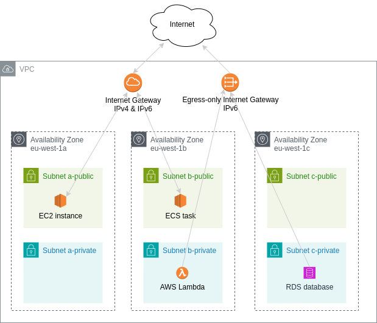

# Pulumi AWS Toolbox

The Pulumi AWS Toolbox is an opinionated library containing components to build the infrastructure for website projects.

It's mostly useful for projects that follow these design ideas:
* being as serverless as possible, with pay per request AWS resources while avoiding resources that incur a fixed cost per hour
* websites that are mostly static using S3 and CloudFront
* backends implemented with AWS Lambda

## Components

### Vpc
The Vpc component is a core component that provides networking functionality. It's needed to run things like EC2 instances, ECS tasks, RDS databases, and AWS Lambda functions. It's an opionionated component focused on the use of IPv6 instead of IPv4 (no NAT gateways provided). It doesn't try to support everything and doesn't provide many configuration options.

Architecture:

It sets up subnets for three availability zones (= data centers). This allows to build applications with very high availability.

Resources in a public subnet can be reached and can communicate to the internet via IPv4 and IPv6.
 * For IPv4, resources need to have a public IPv4 address.
 * AWS Lambda does not support public IPv4 address, you would need NAT gateways for this, which we don't want to use do their cost.

Resources in a private subnet can communicate to the internet only via IPv6 and cannot be reached from the internet at all.
* By default, you should place resources that don't need to be reached from the internet here. 

Components:
* [Jumphost](src/vpc/Jumphost.ts): Creates a jumphost EC2 instance.
* [StdSecurityGroup](src/vpc/StdSecurityGroup.ts): A simple security group for many standard cases.
* [Vpc](src/vpc/Vpc.ts): the VPC component itself.

### Lambda
Components:
* [SimpleNodeLambda](src/lambda/SimpleNodeLambda.ts): Creates a Nodejs AWS Lambda with useful defaults for small & simple tasks.

### SES
Components:
* [SesProxyMailer](src/ses/SesProxyMailer.ts): Creates a AWS Lambda to send email using SES using IPv6 and/or from another account.

### Website
Components:
* [StaticWebsite](src/website/StaticWebsite.ts): Optionionated way of building a static website using CloudFront and S3.

## Scripts

### pulumi-s3-login
By convention we're using Pulumi's S3 backend, with a bucket named "pulumi-state-{AWS_ACCOUNT_ID}".
You can configure Pulumi to use this bucket by running

    npx pulumi-s3-login

This will configure Pulumi to use the bucket of your current AWS account. The bucket must already exist.
